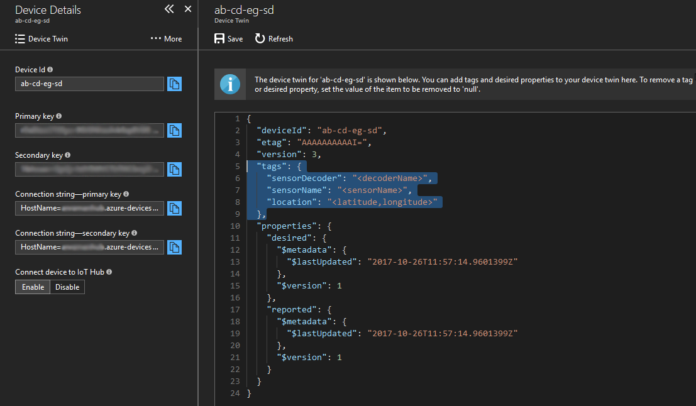

# AzureSolutionTemplate

<a href="https://portal.azure.com/#create/Microsoft.Template/uri/https%3A%2F%2Fraw.githubusercontent.com%2FLoriot%2FAzureSolutionTemplate%2Fmaster%2Fazuredeploy.json" target="_blank">
    
</a>

To run locally, ensure you have the latest Azure CLI installed from [here](https://docs.microsoft.com/en-us/cli/azure/install-azure-cli?view=azure-cli-latest).
Run with the following command:

```powershell
az group deployment create --name ExampleDeployment --resource-group YourResourceGroup --template-file azuredeploy.json --parameters azuredeploy.parameters.json
```

>NOTE: Once deployed, you will need to navigate to the [Azure portal](https://portal.azure.com) and start the Stream Analytics job manually using the button at the top of the blade. For instructions on how to do this if you have chosen to deploy the Power BI component of the template, please see the [power-bi](power-bi/) folder readme.

## Contents

[Device Twin Setup (Required)](#device-twins)

[Power BI (Optional)](#power-bi)

[Device Emulation (Optional)](#device-emulation)

[Router Function](#router-function)

[Setup Function](#setup-function)

[Environment Variables](#environment-variables):

- [LORIOT_APP_ID](#loriotappid)
- [LORIOT_API_KEY](#loriotapikey)
- [LORIOT_API_URL](#loriotapiurl)
- [IOT_HUB_OWNER_CONNECTION_STRING](#iothubownerconnectionstring)
- [EVENT_HUB_ROUTER_INPUT](#eventhubrouterinput)
- [EVENT_HUB_ROUTER_OUTPUT](#eventhubrouteroutput)
- [DOCUMENT_DB_NAME](#documentdbname)
- [DOCUMENT_DB_ACCESS_KEY](#documentdbaccesskey)
- [SQL_DB_CONNECTION](#sqldbconnection)
- [DEVICE_LIFECYCLE_CONNECTION_STRING](#devicelifecycleconnectionstring)
- [DEVICE_LIFECYCLE_QUEUE_NAME](#devicelifecyclequeuename)
- [DEVICE_LIFECYCLE_IMPORT_TIMER](#devicelifecycleimporttimer)

## Device Twin Setup

When adding new devices to the IoT Hub, ensure you modify the Device Twin to include the following tags in order for the routing function to assign the correct decoder:



## Power BI

This deployment also provides (optional) Power BI visualisation functionality as a starting point for data analysis (both realtime and historical). For instructions on how to make use of this capability please look in the [power-bi](power-bi/) folder.

## Device Emulation

Provided with this project is a script that can be used to generate device messages to test the pipeline in the absence of a real device. For more information, see the [test](test/) folder.

## Router Function

The router function is triggered by messages coming from the IoT Hub (connection defined in the EVENTHUB_ROUTER_INPUT environment variable) and routes them to the appropriate decoder.

Routing is done based on the *sensordecoder* property present in the device twins tags in the IoT Hubs (connection defined in the IOT_HUB_OWNER_CONNECTION_STRING environment variable) - see [Device Twin Setup](#device-twins) for more information. The function can access this information using the *iothub-connection-device-id* message property automatically added by the IoT Hub.
In a nutshell, routing takes the following strategy:

- If an environment variable with name "DECODER_URL_*sensordecoder*" or "DECODER_URL_DEFAULT_*sensordecoder*" exists, the message will be routed there.
- If those environment variables are not present in the web app, the message will be automatically routed to a function named after the *sensordecoder* located on the same function app. The route will be https://{nameOfCurrentFunctionApp}.azurewebsites.net/api/{*sensordecoder*}

The output of the function will be directed to an Event Hub (connection defined by EVENT_HUB_ROUTER_OUTPUT environment variable). Output messages are composed of the following subsections:

- MessageGuid: A unique GUID generated by the Router function to track each message.
- Raw: An exact copy of the raw message received from the IoT Hub.
- Metadata: Device twins tags from the IoT Hub.
- Decoded: Message from the IoT device decoded by the appropriate decoder.

## Setup Function

The setup function initialises the Cosmos DB collection and the SQL table needed by the pipeline. The function is automatically triggered at the end of the execution of the ARM template. The function uses environment variables DOCUMENT_DB_NAME, DOCUMENT_DB_ACCESS_KEY and SQL_DB_CONNECTION to connect to the two resources.

If the collection or table already exist, the function will return without doing anything.

## Environment variables

### LORIOT_APP_ID

The LORIOT App ID used to identify under which app the devices are synced.

```
BA7B0CF5
```

### LORIOT_API_KEY

Key used to authenticate requests towards LORIOT servers.

```
********************x9to
```

### LORIOT_API_URL

The base URL of the Network Server Management API used to sync device information between Azure IoT Hub and LORIOT servers.

```
https://eu1.loriot.io/1/nwk/app/
```

### IOT_HUB_OWNER_CONNECTION_STRING

The connection string to the IoT Hub used for device syncing and reading the device registry.

```
HostName=something.azure-devices.net;SharedAccessKeyName=iothubowner;SharedAccessKey=fU3Kw5M5J5QXP1QsFLRVjifZ1TeNSlFEFqJ7Xa5jiqo=
```

### EVENT_HUB_ROUTER_INPUT

The connection string of the IoT Hub's Event Hub, used as trigger on the RouterFunction to send the messages to the appropriate decoders.

```
Endpoint=Endpoint=sb://something.servicebus.windows.net/;SharedAccessKeyName=iothubowner;SharedAccessKey=UDEL1prJ9THqLJel+uk8UeU8fZVkSSi2+CMrp5yrrWM=;EntityPath=iothubname;
SharedAccessKeyName=iothubowner;SharedAccessKey=2n/TlIoLJbMjmJOmadPU48G0gYfRCU28HeaL0ilkqMU=
```

### EVENT_HUB_ROUTER_OUTPUT

Connection string defining the output of the router function to the enriched and decoded message Event Hub.

```
Endpoint=sb://something.servicebus.windows.net/;SharedAccessKeyName=RootManageSharedAccessKey;SharedAccessKey=Ei8jNFRlH/rAjYKTTNxh7eIHlgeleffFekHhnyAxrZ4=
```

### DOCUMENT_DB_NAME

Document Database name

### DOCUMENT_DB_ACCESS_KEY

Key of the Document Database

### SQL_DB_CONNECTION

Connection String of the SQL Database

```
Server=tcp:something.database.windows.net,1433;Initial Catalog=testdbmikou;Persist Security Info=False;
User ID=username;Password=password;MultipleActiveResultSets=False;Encrypt=True;TrustServerCertificate=False;Connection Timeout=30;
```

### DEVICE_LIFECYCLE_CONNECTION_STRING

### DEVICE_LIFECYCLE_QUEUE_NAME

### DEVICE_LIFECYCLE_IMPORT_TIMER